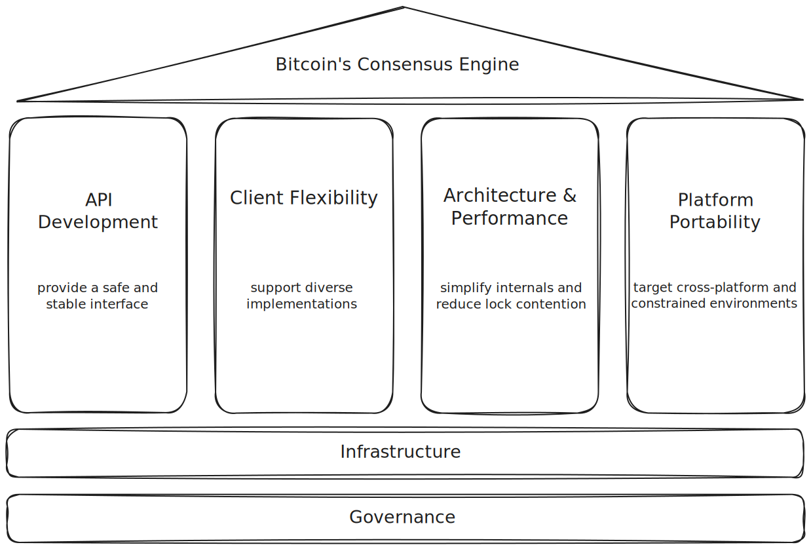

# Bitcoinkernel Project Framework

This document presents a strategic framework for the bitcoinkernel project.

The Bitcoinkernel Project is structured around four pillars that support its mission to serve as Bitcoin's consensus engine. Each pillar represents an area of development focus:

* **API Development** - provide a safe and stable interface for applications to interact with consensus logic
* **Client Flexibility** - support diverse implementations and use cases across the ecosystem
* **Architecture & Performance** - simplify internals and reduce lock contention for efficient operation
* **Platform Portability** - target cross-platform and constrained environments to maximize deployment options

Two foundations support these pillars. **Infrastructure** provides quality assurance, independent repository management, release processes, versioning standards. **Governance** establishes accountability structures to prevent single points of failure.

## Framework Diagram

