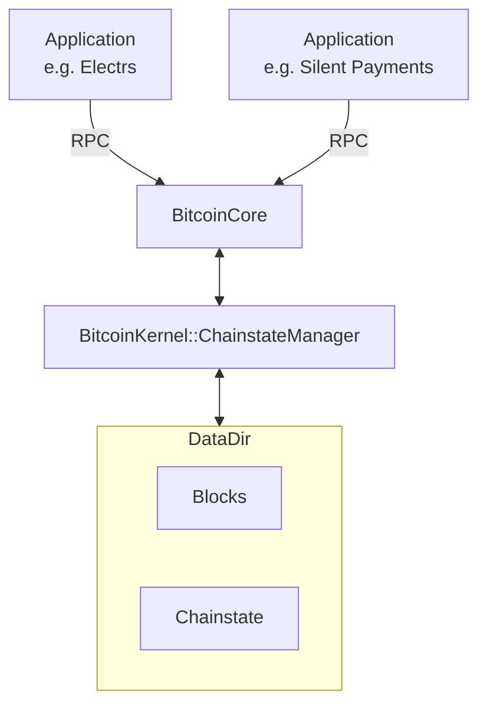
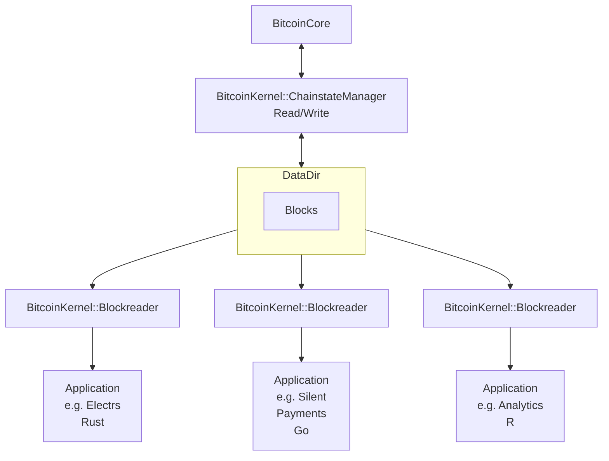

# Bitcoinkernel Blockreader API
## Dependencies

This proposal requires the following PR to be merged before implementation can begin:
- [Bitcoin Core PR #32427: Flat-file BlockTreeStore](https://github.com/bitcoin/bitcoin/pull/32427)

## Introduction
This proposal introduces a read-only BlockReader type to the bitcoinkernel
library, enabling multiple clients to traverse the chain and read historical
block data in parallel.

## Motivation
Applications like block explorers, chain analysis tools, and data indexers need
access to data but don't need to validate new blocks. The current
ChainstateManager API requires resources that are not necessary for most
read-only use cases. Furthermore, It is currently only possible to have a single
instance of the ChainstateManager be instantiated due to locking of LevelDB that
is required for the UTXO set.

### Problems with Current Approach
```cpp
// Current: Must create full ChainstateManager
ChainstateManager chainman = /* full utxo and chain initialization */;
// Just to read some blocks!
```

**Issues:**
- Requires UTXO (LevelDB) database initialization, which only permits a
  single parallel instance

### Proposed Solution

Introduce a **BlockReader type** within the libbitcoinkernel API that supports
chain traversal and reading blocks from disk. The BlockReader's minimal
structure enables an architecture where a data directory is shared between:

1. **One writer:** A bitcoinkernel instance with a ChainstateManager in a
       fully functional node
2. **Multiple readers:** BlockReader instances exposing read-only
       functionality to external applications
```c
// New: Lightweight BlockReader type
btck_BlockReader* reader = btck_blockreader_create(context, options);
btck_Block* block = btck_blockreader_read_block(reader, entry);
// Multiple BlockReader instances can run in parallel
```

#### Architecture Comparison

##### Current Architecture



##### Target Architecture


#### API Overview

The BlockReader type consists of four main components:

1. **Lifecycle Management** - Create and destroy readers
2. **Chain Access** - Obtain and release references to the validated chain
3. **Block Access** - Read blocks and block spent outputs data from disk
4. **State Management** - Refresh chain view when needed

##### Complete API Surface
```c
// ============================================================================
// Lifecycle
// ============================================================================

btck_BlockReaderOptions* btck_blockreader_options_create(
    const btck_Context* context,
    const char* data_directory,
    size_t data_directory_len,
    const char* blocks_directory,
    size_t blocks_directory_len);

void btck_blockreader_options_destroy(
    btck_BlockReaderOptions* options);

btck_BlockReader* btck_blockreader_create(
    const btck_BlockReaderOptions* options);

void btck_blockreader_destroy(
    btck_BlockReader* reader);

// ============================================================================
// Chain Access
// ============================================================================

const btck_Chain* btck_blockreader_get_validated_chain(
    const btck_BlockReader* reader);

void btck_chain_destroy(
    const btck_Chain* chain);

// ============================================================================
// Block Access
// ============================================================================

btck_Block* btck_blockreader_read_block(
    const btck_BlockReader* reader,
    const btck_BlockTreeEntry* entry);

btck_BlockSpentOutputs* btck_blockreader_read_block_spent_outputs(
    const btck_BlockReader* reader,
    const btck_BlockTreeEntry* entry);

// ============================================================================
// State Management
// ============================================================================

int btck_blockreader_refresh(
    btck_BlockReader* reader);
```

## Detailed Design

### Type Definitions
```c
// New opaque handles
typedef struct btck_BlockReader btck_BlockReader;
typedef struct btck_BlockReaderOptions btck_BlockReaderOptions;
```

### Memory Model

**Ownership Rules:**

| Function | Return Type | Ownership |
|----------|-------------|-----------|
| `btck_blockreader_create` | `btck_BlockReader*` | **Owned** - caller must destroy |
| `btck_blockreader_read_block` | `btck_Block*` | **Owned** - caller must destroy |
| `btck_blockreader_get_validated_chain` | `const btck_Chain*` | **Owned** - caller must destroy |

### Chain Reference Counting

**Critical Behavior:** Chain pointers are reference counted and remain valid
until explicitly released:
```c
// Get chain - increments reference count
const btck_Chain* chain = btck_blockreader_get_validated_chain(reader);
process(chain);

// Chain remains valid even after refresh
btck_blockreader_refresh(reader);

// Original chain pointer still valid - points to old state
process(chain);

// Get updated chain if needed
const btck_Chain* new_chain = btck_blockreader_get_validated_chain(reader);
process(new_chain);  // Now using post-refresh chain

// Must release both chains when done
btck_chain_release(chain);
btck_chain_release(new_chain);
```

**Rationale:** Reference counting allows applications to safely hold chain
pointers across refresh operations, preventing dangling pointer issues. The
trade-off is increased memory usage (multiple chain snapshots may exist) and the
requirement for explicit cleanup.

**Memory Management Rules:**
- Each call to `btck_blockreader_get_validated_chain()` increments the
  reference count
- Applications MUST call `btck_chain_destroy()` for every chain pointer
  obtained
- Failure to release chains will cause memory leaks

### Thread Safety

**Guarantees:**
- Multiple threads can safely read concurrently from the same
  `btck_BlockReader`
- Multiple threads can hold different `btck_Chain` pointers
  simultaneously
- `btck_blockreader_get_validated_chain()` and
  `btck_blockreader_refresh()` are thread-safe
- Each `btck_Chain` pointer remains valid until explicitly released via
  `btck_chain_release()`, or until the `btck_BlockReader` that created it is
  destroyed

**Memory Management Requirements:**
- Each thread must destroy its own `btck_Chain` pointers via
  `btck_chain_destroy()`
- Failure to destroy chains will cause memory leaks

```c
// Safe: concurrent reads with independent chain references
// Thread 1
void* reader_thread_1(void* arg) {
    btck_BlockReader* reader = (btck_BlockReader*)arg;
    const btck_Chain* chain = btck_blockreader_get_validated_chain(reader);
    size_t height = btck_chain_get_height(chain);
    btck_chain_destroy(chain);  // Must destroy when done
    return NULL;
}

// Thread 2
void* reader_thread_2(void* arg) {
    btck_BlockReader* reader = (btck_BlockReader*)arg;
    const btck_Chain* chain = btck_blockreader_get_validated_chain(reader);
    size_t height = btck_chain_get_height(chain);
    btck_chain_destroy(chain);  // Must destroy when done
    return NULL;
}

// ═══════════════════════════════════════════════════════════════════

// Safe: refresh while reading - chain pointers remain valid
// Thread 1: reading chain data
void* reader_thread(void* arg) {
    btck_BlockReader* reader = (btck_BlockReader*)arg;
    const btck_Chain* chain = btck_blockreader_get_validated_chain(reader);

    // Thread 1 is using the chain...
    for (size_t i = 0; i < btck_chain_get_height(chain); i++) {
        const btck_BlockTreeEntry* entry = btck_chain_get_by_height(chain, i);
        // Processing block...
    }

    btck_chain_destroy(chain);  // Destroy when done
    return NULL;
}

// Thread 2: refreshing
void* refresh_thread(void* arg) {
    btck_BlockReader* reader = (btck_BlockReader*)arg;
    btck_blockreader_refresh(reader);  // SAFE - Thread 1's chain remains valid

    // Get the new chain state if needed
    const btck_Chain* new_chain = btck_blockreader_get_validated_chain(reader);
    // Use new_chain...
    btck_chain_destroy(new_chain);
    return NULL;
}
```

## Naming Considerations for Existing Block Access Functions

The current bitcoinkernel API includes block access functions:
- `btck_block_read()`
- `btck_block_spent_outputs_read()`

These functions were intentionally named without the `chainstate_manager_`
prefix to allow for their eventual placement on a BlockManager abstraction that
could be shared between ChainstateManager and other components.

### Proposed Rename

With the introduction of BlockReader, we should consider renaming these
functions to maintain consistency:

**Current:**
```c
btck_Block* btck_block_read(
    const btck_ChainstateManager* chainman,
    const btck_BlockTreeEntry* entry);

btck_BlockSpentOutputs* btck_block_spent_outputs_read(
    const btck_ChainstateManager* chainman,
    const btck_BlockTreeEntry* entry);
```

**Proposed:**
```c
btck_Block* btck_chainstate_manager_read_block(
    const btck_ChainstateManager* chainman,
    const btck_BlockTreeEntry* entry);

btck_BlockSpentOutputs* btck_chainstate_manager_read_block_spent_outputs(
    const btck_ChainstateManager* chainman,
    const btck_BlockTreeEntry* entry);
```

This change would:
- Align with naming conventions used for other methods
- Clearly indicate these methods operate on ChainstateManager instances
- Distinguish them from the new BlockReader methods

### Why Not Preserve via BlockManager Abstraction?

While the original design allowed for a BlockManager abstraction, introducing it
provides minimal practical benefit. It would require:
1. Adding a new `btck_BlockManager` type to the API
2. Adding `btck_chainstate_manager_get_block_manager()` to
       ChainstateManager
3. Adding `btck_blockreader_get_block_manager()` to BlockReader
4. Changing the parameter type of some existing functions from
       `btck_ChainstateManager*` to `btck_BlockManager*`

## Breaking Changes

Renaming existing block access functions would require API updates:

| Current Name | Proposed Name |
|--------------|---------------|
| `btck_block_read()` | `btck_chainstate_manager_read_block()` |
| `btck_block_spent_outputs_read()` | `btck_chainstate_manager_read_block_spent_outputs()` |

**Migration Path:**
```c
// Old API
btck_Block* block = btck_block_read(chainman, entry);

// New API
btck_Block* block = btck_chainstate_manager_read_block(chainman, entry);
```

## Alternatives Considered

### Alternative 1: Borrowed Pointers with Invalidation
```c
const btck_Chain* chain = btck_blockreader_get_validated_chain(reader);
process(chain);

// Refresh invalidates chain pointer
btck_blockreader_refresh(reader);

// Must get fresh pointer - old chain pointer is now dangling
chain = btck_blockreader_get_validated_chain(reader);
process(chain);
```

**Rejected Because:**
- Dangling pointer bugs if users access chain after refresh
- Not thread-safe - requires external synchronization around refresh
- Follows C conventions (like `realloc()`) but those conventions exist
  due to performance constraints we don't have here

### Alternative 2: Extend ChainstateManager
```c
// Add read-only mode via options to ChainstateManager
btck_ChainstateManagerOptions* opts = btck_chainstate_manager_options_create(...);
btck_chainstate_manager_options_set_read_only(opts, 1);
btck_ChainstateManager* chainman = btck_chainstate_manager_create(opts);
```

**Rejected Because:**
- ChainstateManager is inherently write-oriented
- Would require significant refactoring
- Confusing to have write-oriented API (process_block, etc.) available in
  read-only mode

##### Alternative 3: Auto-Refresh
```c
// Automatically detect and refresh when stale
const btck_Chain* chain = btck_blockreader_get_validated_chain(reader);
// Always returns current state
```

**Rejected Because:**
- Hidden operations
- Unpredictable performance
- May require background threads or polling
- Users lose control over when I/O happens

## Implementation Details

### Chain Construction

The BlockReader (its own class) constructs its validated chain view by loading
the block index from disk, filtering validated blocks, and sorting by most
cumulative work. This happens during initialization via
`btck_blockreader_create()` and can be refreshed later via
`btck_blockreader_refresh()`.
```cpp
/**
 * Update validated chain by loading block index and setting tip to block with most work.
 *
 * @return true if successful, false on database load failure
 * @post If successful and validated blocks exist, m_validated_chain is instantiated
 *       with the updated tip
 */
bool BlockReader::UpdateValidatedChain()
{
    std::vector<CBlockIndex*> validated_blocks;
    {
        LOCK(cs_main);
        if (!m_blockman->LoadBlockIndexDB({})) {
            LogWarning("Failed to load block index database");
            return false;
        }
        for (CBlockIndex* index : m_blockman->GetAllBlockIndices()) {
            if (index->IsValid(BLOCK_VALID_SCRIPTS)) {
                validated_blocks.push_back(index);
            }
        }
    }

    if (!validated_blocks.empty()) {
        std::sort(validated_blocks.begin(), validated_blocks.end(),
                  node::CBlockIndexWorkComparator());

        // Instantiate and atomically set new validated chain
        auto new_chain{std::make_shared<CChain>()};
        new_chain->SetTip(*validated_blocks.back());
        std::atomic_store(&m_validated_chain, new_chain);
    }
    return true;
}
```

#### Key Points:

1. **Validation Level:** Only blocks with `BLOCK_VALID_SCRIPTS` or higher
       are included in the validated chain. This ensures the BlockReader only
       exposes blocks that have been fully validated by a ChainstateManager
       instance.
2. **Chain Selection:** Blocks are sorted by cumulative work
       (`CBlockIndexWorkComparator`), and the chain tip is set to the block
       with the most accumulated proof-of-work. This mirrors the active chain
       selection logic used by ChainstateManager.
3. **Refresh Semantics:** When `btck_blockreader_refresh()` is called,
       this method constructs a new chain snapshot and atomically replaces the
       internal reference. Existing chain pointers held by callers remain valid
       and point to the pre-refresh state until explicitly destroyed via
       `btck_chain_destroy()`.
4. **Reference Counting:** The chain is stored as a
       `std::shared_ptr<CChain>`, enabling safe concurrent access. Each call
       to `btck_blockreader_get_validated_chain()` increments the reference
       count, and each call to `btck_chain_destroy()` decrements it. The chain
       memory is freed when the reference count reaches zero.

### File Locking for BlockTreeStore

The BlockTreeStore is a flat-file database introduced in [Bitcoin Core PR
#32427](https://github.com/bitcoin/bitcoin/pull/32427), which replaces the
previous LevelDB-based block index storage. To coordinate access between a
ChainstateManager (writer) and the BlockReader instance(s), an advisory locking
mechanism is implemented.

#### Lock Mechanism

**Lock File:** `<blocks_dir>/index/.blocktreelock`

**Lock Behaviour:**
- **Writer (ChainstateManager):** Acquires and holds an exclusive lock for
  its entire lifetime
- **Readers (BlockReaders):** Probe for lock existence but do not acquire
  locks themselves

This design allows writers and readers to coexist, with readers accepting
potential temporary consistency during write operations.
