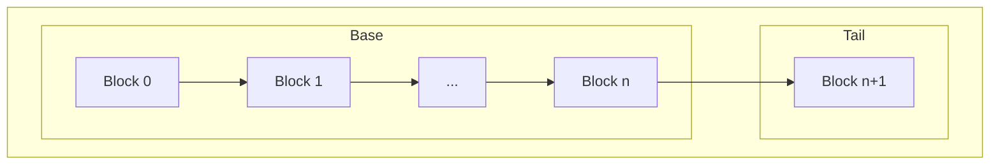
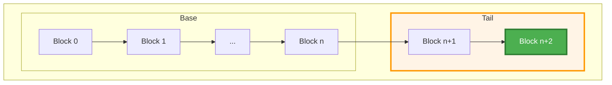
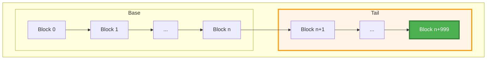
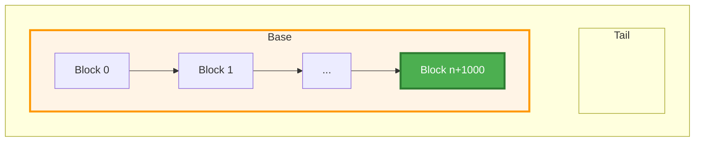
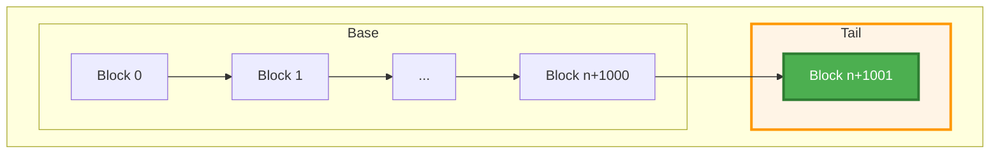

# CChain Concurrency Enhancement

## Metadata

<table>
<tr>
<td width="60%" style="vertical-align: top; border: none;">

| Field | Value |
|-------|-------|
| **Type** | Enhancement |
| **Status** | Draft |
| **Pillar** | Architecture & Performance |
| **Related Work** | [Preliminary implementation](https://github.com/alexanderwiederin/bitcoin/tree/chain-base-tail) |
| **Date Created** | 2024-12-16 |
| **Last Updated** | 2024-12-23 |

</td>
<td width="40%" style="vertical-align: top; border: none;">


</td>
</tr>
</table>

## Summary

Improve CChain multi-threaded performance by minimizing lock hold times and
ensuring consistent snapshots through an immutable copy-on-write design.

## Problem Statement
The current CChain implementation uses a single vector protected by `cs_main`,
creating a performance bottleneck in multi-threaded scenarios.

### Current Implementation
```cpp
class CChain
{
private:
    std::vector<CBlockIndex*> vChain; // Protected by cs_main

public:
    CBlockIndex* Tip() const
    {
        return vChain.size() > 0 ? vChain[vChain.size() - 1] : nullptr;
    }
    // All access requires holding cs_main
};
```
**Issues:**
- **Write blocking:** Writers must hold exclusive lock, blocking all readers
- **Inconsistent state:** Can not capture consistent view without holding lock
  throughout operation
- **Read contention:** Multiple readers block each other unnecessarily

**Example of Current Overhead:**
```cpp
// Current: must hold lock for entire operation or risk inconsistent state
LOCK(cs_main);
int height = chain.Height();
CBlockIndex* tip = chain.Tip();

for (int i = 0; i < height; i++) {
    process(chain[i]);
}
```

## Goals

**Primary Goals:**
The primary goals are to eliminate lock contention during concurrent read
operations, enable consistent multi-step reads, minimize lock time during writes
operations and maintain backward compatability with the existing CChain API.

**Non-Goals:**
The non-goals include improving Initial Block Download (IBD) performance and
optimizing reorganization performance.

## Proposed Solution

Replace the single vector with a two-vector structure (`base` + `tail`)
protected by a mutex. Sequential block additions use a fast-path `tail` append,
replacing the old tail pointer. When the tail fills (i.e. reaches a predetermined
size), `base` and `tail` are merged into a new immutable `base`. This copy-on-write approac
enables enables consistent reads through snapshots (`CChain::Snapshots`) that capture
constistent point-in-time views.
```cpp
class CChain
{
private:
    // Immutable base: mose of the chain
    std::shared_ptr<const std::vector<CBlockIndex*>> m_base;

    // Immutable tail: recent blocks (max 1000)
    std::shared_ptr<const std::vector<CBlockIndex*>> m_tail;

    // Mutex protects both reads and writes
    mutable std::mutex m_mutex;

    static constexpr size_t MAX_TAIL_SIZE = 1000;

public:
    /**
     * Get a consistent snapshot of the chain.
     *
     * This acquires a mutex to ensure both base and tail are read atomically.
     * The returned snapshot provides a consistent view that will not change
     * even if the chain is updated by other threads.
     */
    Snapshot GetSnapshot() const
    {
        std::lock_guard lock(m_mutex);
        return Snapshot(m_base, m_tail);
    }
};
```

### Write Mechanics

#### Step 1: Initial State

**State:** Base contains historical blocks 0 through n. Tail contains the most
recent block n+1.


#### Step 2: Sequential Appends between 1 and `MAX_TAIL_SIZE`

**Operation:** New blocks are added by copying the tail, appending the new block
and atomically swapping the tail pointer. Base remains untouched.



**Performance:** Copies only the tail (average ~500 blocks), not the entire chain.

#### Step 3: Merge Operation - Tail grows to MAX_TAIL_SIZE

**Operation:** When tail reaches 1000 blocks, base and tail are merged into a
new immutable base vector. The tail is reset to empty.


**Performance:** Copies the entire chain once per 1000 blocks.

#### Step 4: Repeat

**Operation:** Tail is copied and the new block is inserted.



Fast-path appends until the next merge is triggered.

### Read mechanics

Snapshots provide a stable, point-in-time view of the chain. Multiple operations
on the same Snapshot always see consistent state, unaffected by concurrent
modifications to the CChain by other threads.
```cpp
class Snapshot
{
private:
    std::shared_ptr<const std::vector<CBlockIndex*>> m_base;
    std::shared_ptr<const std::vector<CBlockIndex*>> m_tail;

public:
    /** Returns the index entry at a particular height in this chain, or nullptr if no such height exists. */
    CBlockIndex* operator[](int nHeight) const
    {
        if (nHeight < 0) return nullptr;

        if (nHeight < (int)m_base->size()) {
            return (*m_base)[nHeight];
        }

        size_t tail_idx = nHeight - m_base->size();
        if (tail_idx < m_tail->size()) {
            return (*m_tail)[tail_idx];
        }

        return nullptr;
    }
};
```

#### Memory Management
**Lifetime Guarantees:** Snapshots use `shared_ptr` for automatic memory
management, keeping vectors alive as long as any snapshots holds a reference.
When the last snapshot referencing a specific state is destroyed, old vectors
are automatically freed.

### Concurrent Access Patterns

**Pattern 1: Multiple Concurrent Readers**
```cpp
// Thread 1
void* reader_thread_1(void* arg) {
    auto snap = chain.GetSnapshot();  // Acquires mutex briefly
    // Mutex released - can now read without contention
    for (int i = 0; i < snap.Height(); i++) {
        process(snap[i]);
    }
    return NULL;
}

// Thread 2
void* reader_thread_2(void* arg) {
    auto snap = chain.GetSnapshot();  // May briefly wait for Thread 1's GetSnapshot
    // Once snapshot acquired, no contention with Thread 1
    CBlockIndex* tip = snap.Tip();
    analyze(tip);
    return NULL;
}

// Brief mutex contention during GetSnapshot, then parallel execution
```

**Pattern 2: Reader While Writer Updates**
```cpp
// Thread 1: Long-running read
void* reader_thread(void* arg) {
    auto snap = chain.GetSnapshot(); // Acquired mutex briefly

    // Long operation - chain may be updated during this time
    // No lock held during this phase
    for (int i = 0; i < snap.Height(); i++) {
        expensive_operation(snap[i]);
    }

    // Snapshot still consistent with original state
    return NULL;
}

// Thread 2: Writer
void* validation_thread(void* arg) {
    // Writer updates chain (acquires m_mutex)
    chain.SetTip(new_block);  // Holds mutex during update

    // Thread 1's snapshot unaffected - still sees old state
    // New readers will see new state
    return NULL;
}
```

**Key Improvement over current implementation:**
While the mutex is held briefly during `GetSnapshot()` and `SetTip()`,
readers can proceed with length operations on their snapshots without holding
any locks. This eliminates the current bottleneck where `cs_main` must be
held for the entire duration of chain access.

## Open Questions

1. What is the ideal `MAX_TAIL_SIZE`? Shorter chain favors shorter tail,
       longer chain favors longer tail.
2. **Could the tail also be a different data structure to optimize write
       speed?** Current benchmarking results suggest this will be required
3. **How many locks can safely be removed?** [Bitcoin Core Locking/mutex usage notes](https://github.com/bitcoin/bitcoin/blob/master/doc/developer-notes.md#lockingmutex-usage-notes)
4. **Could we use a read-write lock (shared_mutex) instead?** This would
       allow truly concurrent reads during `GetSnapshot()` while still
       preventing the race condition between reading `m_base` and `m_tail`.

